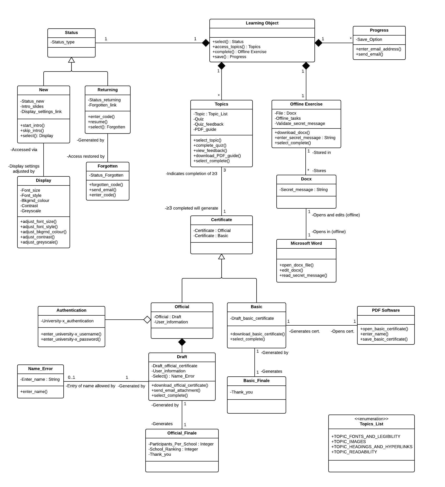

My blog title is a direct quote of Lawrence Weiner's _Bits & Pieces Put Together to Present a Semblance of a Whole_ (1991) an artwork installed at the Walker Art Centre, Minneapolis, MN, USA. Take a look at the walkerart.org site: [http://www.walkerart.org/collections/artworks/bits-and-pieces-put-together-to-present-a-semblance-of-a-whole](http://www.walkerart.org/collections/artworks/bits-and-pieces-put-together-to-present-a-semblance-of-a-whole "http://www.walkerart.org/collections/artworks/bits-and-pieces-put-together-to-present-a-semblance-of-a-whole")

> ## 1.1 Purpose
> 
> **The problem (in one sentence):** Changes to support-related funding for disabled students necessitates the need to increase academic staff knowledge of best practices involving technology to support disabled students.

Well I have been working away on a number of things and they ARE starting to resemble a whole, which is encouraging. For a while there, I felt like I was in a sort of limbo struggling to see the connections between my activities. I decided to start work on the concept document. I looked at a few different documentation standards, however I finally settled on adapting the NASA software documentation standard(NASA-STD-2100-91, 1991). The activity of starting to pull together some of the project background information, as previously explored on this blog, in-writing has been really helpful. That work is summarised in the _problem_ sentence above. The idea of producing a sentence-long summary is influenced by LEAN principles as applied to UX (Gothelf, 2013, p.20), although not having an original interactive system that I being commissioned to replace it is more about having a succinct statement to sum-up why what I am designing is important. Furthermore, I decided that it was time to look back through the characteristics, hierarchical task breakdown and task scenarios in order to check for any inconsistencies and as a means to validate aspects of my UML diagram. I identified a number of naming differences that are now revised and standardised conventions have been established across the design artifacts. The main realisation about the hypothetical Learning Object (for university-x; a fictional university) was that for a tool with the primary goal of promoting accessibility, there was no accessibility built into its interaction. Part of offering responsive accessibility options is allowing the user to specify their needs and I realised that this needed to feature in both the tasks and the interaction design for new users entering the Learning Object. This is now included and reflected in the UML diagram below (version 5). Another realisation, also on the accessibility front, was that I had previously stated that PDF guides would be made available, related to each of the Learning Topic quizzes in the Learning Object. I noticed that I had not included an interaction to allow for the download of 'said' PDFs. Another aspect that was missing, was the gamification element which I had so painstakingly thought about during the characteristics phase. Due to the constraints of the project, these features cannot be sophisticated, however _some_ features should still be there! Namely there was no ending to the learning object and I conceived that staff would be expecting some kind of conclusion, however basic. Therefore I have included a finale, which will feature _number of participants per school_ and _school rank_. Very basic, but it may motivate users in university-x to encourage colleagues to take part in order to promote their place on this leader board. For non-university-x users then the finale will be a simple "thank you" page. Now I need to get back to the requirements and wireframing, but I had to get that stuff out of the way first. As previously mentioned, I think that I have realised that Learning Objects are fairly hard to design from scratch as there are some built-in expectations about how they work and how users interact with them. On the one hand it is good, as the user knows what they are getting with a leaning object, the same way they do when buying their favourite brand of cereal. On the other it is fairly constraining from a design perspective as it means that there are certain things that need to be included even if they feel redundant (the user marking completion of activities for example; this is pretty essential as it unlocks or allows progression to other areas of the LO, but it feels like it should be automated). Also this activity has really helped me to think about structural aspects of all eLearning systems, which very often seem more like vessels for a collection of functionality rather than unified products. This Learning Object is no different, the illusion of cohesion will be the mission of design; such a large proportion of educating is about design. **UML Version 5 - 6/12/15  ** **References** Gothelf, J. (2013). _Lean UX: Applying Lean Principles to Improve User Experience_ (1st ed.). United States: O’Reilly Media, Inc, USA. NASA-STD-2100-91. (1991). _NASA software documentation standard_. Retrieved 29 November 2015, from http://ntrs.nasa.gov
