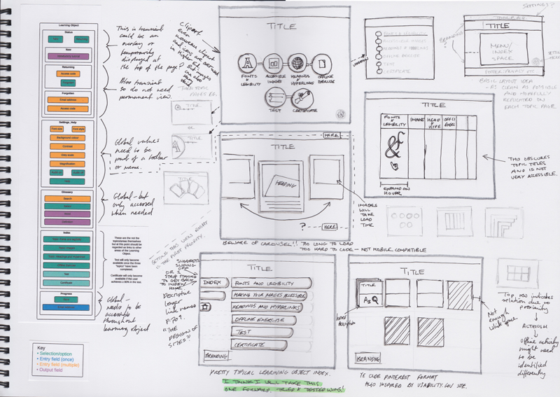

 **References** Van Duyne, D. K., Landay, J. A., & Hong, J. I. (2007). _The design of sites: Patterns for creating winning web sites_ (2nd ed.). USA: Prentice Hall PTR. Notes: the usability.gov website is mentioned ([http://www.usability.gov](http://www.usability.gov "http://www.usability.gov")). I particularly like the quick reference tabs on the left of the site, which slide out on hover. Also the type enlargement tool on their site, it is easy to use and very effective. Their page, [http://www.usability.gov/site-tour.html](http://www.usability.gov/site-tour.html "http://www.usability.gov/site-tour.html") which explains the site is really fascinating, in terms of showing the decisions that they made and why. I have also watched their webinar about the revamp of the site, featured on the page above. Some key questions, funnily enough I keep coming back to these too! - What are the goals of this website (in my case web application in the form of a Learning Object)? - Who is the audience and who are our users? - What are their goals?
