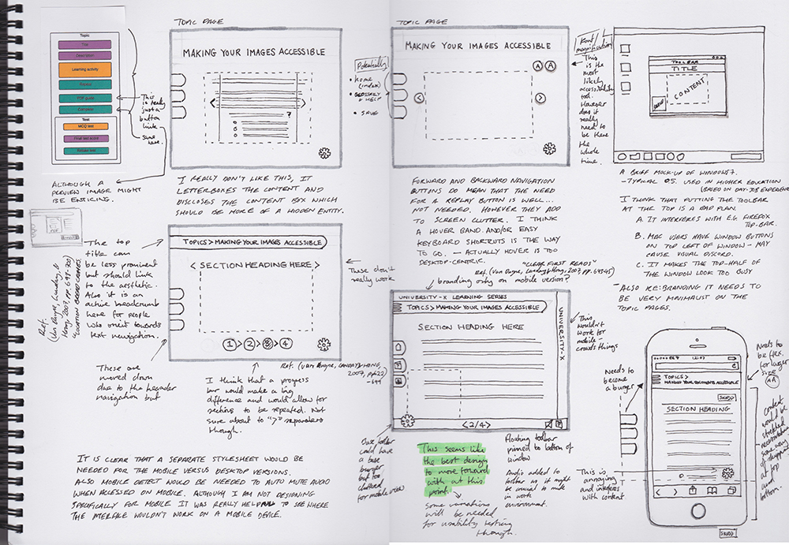

\[caption id="attachment\_490" align="alignnone" width="1000"\] Click on image to view a larger version in a new tab.\[/caption\]   **References** Van Duyne, D. K., Landay, J. A., & Hong, J. I. (2007). _The design of sites: Patterns for creating winning web sites_ (2nd ed.). USA: Prentice Hall PTR.
