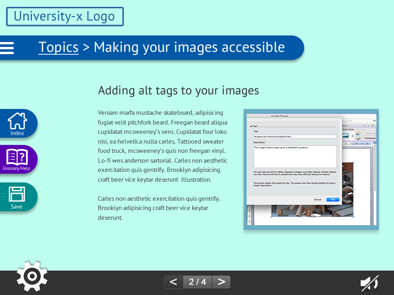

The title of this blog post is a nod in the direction of [Mr. Gary Numan](https://youtu.be/ZF4Z6smOrZw "Gary Numan in 1979"). It felt like the right time to get some simple mock-ups ready in Adobe Fireworks; thus we became electric and moved away from paper, but only temporarily as this will speedup some of the low-fi paper prototypes that I plan later on. Fireworks seemed like the best choice as it is javascript-centric and I think that in all likelihood the final product would be coded in [Bootstrap JS](http://getbootstrap.com/ "Bootstrap main site") (but that would be up to my hypothetical developer). This is going to be a very long journal entry as there were a lot of decisions involved in taking the jump to the new format. Bear with me. So first on my list, although I did it second (as I 'think' _in colour_) was to create a flexible frame-based mock-up of a topic page where learning content would be delivered. The frame size is set to 805 X 604 as this is the size of the window typically specified by [Xerte](https://www.nottingham.ac.uk/xerte/index.aspx "Xerte webpage"), the University of Nottingham's Learning Object creation tool. The specific Xerte example that I drew inspiration from can be found at the following link: [http://www.nottingham.ac.uk/toolkits/play\_8203](http://www.nottingham.ac.uk/toolkits/play_8203 "Xerte online toolkit example"). You will see that my progression buttons at the bottom of the page bears some resemblance to theirs, as I felt that it was an elegant solution to the problem in both a browser window and on a mobile device. I would be sure to cite this in my final code! However, I do think that a bit of polishing is needed and possibly an alternative for testing purposes; I think that the "2 / 4" looks like a button too, which could lead to confusion, so that is something to fix.

<table><tbody><tr><td>First simple grey scale wireframe</td></tr><tr><td>&nbsp;</td></tr></tbody></table>

**Several key decisions have gone into the wireframes:**

1. I decided to use icons in order to minimise the size of side tabs (rather than text alone). I did not take this decision lightly as icons can be problematic due to individual interpretation. I looked through a cross section of modern icon collections online and I felt that the icons shown above were modern and appropriate for the user group of the learning object. The _Index_ and _Save_ icons are directly from the collection, _Glossary/Help_ button is my own unique icon taking some inspiration from the icon set. I found the icon set at, [http://ewebdesign.com/](http://ewebdesign.com/ "http://ewebdesign.com/") ([direct link to page](http://ewebdesign.com/web-outline-icons/ "direct link to source")). The icon set is originally from [http://dryicons.com](http://dryicons.com "http://dryicons.com") and licensed under a Creative Commons Attribution 3.0 unported license ([https://creativecommons.org/licenses/by/3.0/](https://creativecommons.org/licenses/by/3.0/ "https://creativecommons.org/licenses/by/3.0/")\*), so the source of these icons would need to be cited in the code and site attributions. However at this point in the design process they are really just placeholders pending the decision of the Graphic Designer on the eventual (hypothetical) design team. I did try out an alternative save button from the icon set, just to test. However it did not work as well as the conventional floppy disk icon as shown below. 
2. The _cog_ on the bottom left, as a button to access settings _feels_ correct in terms of positioning and I think that it stands out as an interactive tool without adding too much distraction to the learning environment. This cog is my own Adobe Illustrator drawing based on a cog designed by [http://www.gentleface.com](http://www.gentleface.com "http://www.gentleface.com") under a Creative Commons Attribution-NonCommercial 3.0 unported license ([http://creativecommons.org/licenses/by-nc/3.0/](http://creativecommons.org/licenses/by-nc/3.0/ "http://creativecommons.org/licenses/by-nc/3.0/") - as this is student work I am definitely not getting any commercial gain from this). I found the cog at iconfinder.com ([direct link to page](https://www.iconfinder.com/icons/42195/cog_icon#size=48 "iconfinder direct source link")). The positioning and style of the cog was a result of my earlier on-paper sketching, so I feel that, that process was particularly valuable.
3. Revisiting the wireframe above it seems that the audio mute button might want to be bigger in order to be more symmetrical with the settings button. I liberated the audio from the "settings" area; I have yet to fully define how the settings area will look. I did this because if an end-user were accessing the Learning Object from a mobile device they would want the default to be mute and then they could choose to turn on the audio narrative if they had headphones plugged into their device. Based on this I felt that making the audio settings more present and clickable/tapable would benefit, both users on desktop computers in office environments where computer noise might not be preferable and those on mobile devices.

\*A closer inspection of the web site's terms showed that the icons cannot be transformed in any way and have to be used as-is. The colour is inverted but other than that there are no structural changes. This suggests that these icons will need to be replaced in the final version of the site. See free license agreement section: [http://dryicons.com/terms/](http://dryicons.com/terms/ "http://dryicons.com/terms/")

## EXPERIMENT TIME!!

<table><tbody><tr><td>Then in reference to decision 1 above, I wondered if the icons could stand on their own without the titles. So I gave that a go...</td></tr><tr><td></td></tr><tr><td>But then I thought how do you deal with any uncertainty about the icons. Perhaps a JS popover? I explored how that would look, just out of interest. I don't think that it was successful (click on the image below for the interactive version).</td></tr><tr><td></td></tr><tr><td><strong>CLICK on the image above to try the interactive version in a new tab. Hover over the HOME/INDEX button to see the "popover" appear.</strong></td></tr></tbody></table>

As I mentioned at the beginning of this post, I started with colour prototypes. The colour scheme was loosely inspired by the University of Exeter's blue, as outlined in their [visual identity guidelines](http://www.exeter.ac.uk/designstudio/visualidentity/thelogo/ "University of Exeter visual identity") although the branding for university-x needs a bit more thought.

<table><tbody><tr><td>Colour hex values annotation is included for later reference.</td></tr><tr><td></td></tr></tbody></table>

As part of the accessibility settings it is necessary for the user to be able to change the font in the interface. I tried a few experiments to see how this would look, as different fonts take up differing amounts of space on the page. It would also be necessary to provide a contextual preview of these settings as users altered them, so they could see how the fonts and other adjustments would manifest. I chose the fonts very carefully as although it would be great to offer a font like Verdana as a legible sans-serif, particularly because it distinguishes letters which often get confused "I" and "L", there are some font licensing considerations to bear in mind. I liked the example provided by the WebAIM accessibility website ([http://webaim.org/techniques/fonts/](http://webaim.org/techniques/fonts/ "http://webaim.org/techniques/fonts/")) where they use the word "_Illustration"_ to show the legibility difference between Arial and Verdana: e.g. in Verdana: Illustration and Arial: Illustration. I have included this word in my examples below to help show differences between the fonts. With regard the licensing issue mentioned above, as the ethos of this learning object is open source and having checked font distribution licensing for Verdana, Arial and others and finding that they were not ideal, I sought open source alternatives. Examples and annotation is provided below. It is also important the the selected fonts provide language support for translation engine purposes. Font 1, the default, is PT Sans (shown in all visual examples above) a family licensed by the ParaType Ltd foundry: [http://www.paratype.com/public/pt\_openlicense\_eng.asp](http://www.paratype.com/public/pt_openlicense_eng.asp "http://www.paratype.com/public/pt_openlicense_eng.asp")

<table><tbody><tr><td>Font 2 - Liberation at 12pt - license: SIL Open Font License (<a title="http://scripts.sil.org/cms/scripts/page.php?site_id=nrsi&amp;id=OFL" href="http://scripts.sil.org/cms/scripts/page.php?site_id=nrsi&amp;id=OFL" target="_blank" rel="noopener noreferrer">http://scripts.sil.org/cms/scripts/page.php?site_id=nrsi&amp;id=OFL</a>) source: <a title="https://fontlibrary.org/en/font/liberation-sans" href="https://fontlibrary.org/en/font/liberation-sans" target="_blank" rel="noopener noreferrer">https://fontlibrary.org/en/font/liberation-sans </a>Partial language support, stated 99% at fontlibrary.org Comments: this font does distinguish between<em> I</em> and<em> L</em> and is quite a standard sans-serif. A bit more compact than PT Sans.</td></tr><tr><td></td></tr><tr><td>Font 3 - Encode Sans at 12pt - license: SIL Open Font License (<a title="http://scripts.sil.org/cms/scripts/page.php?site_id=nrsi&amp;id=OFL" href="http://scripts.sil.org/cms/scripts/page.php?site_id=nrsi&amp;id=OFL" target="_blank" rel="noopener noreferrer">http://scripts.sil.org/cms/scripts/page.php?site_id=nrsi&amp;id=OFL</a>) source:&nbsp;<a title="https://fontlibrary.org/en/font/encode-sans" href="https://fontlibrary.org/en/font/encode-sans" target="_blank" rel="noopener noreferrer">https://fontlibrary.org/en/font/encode-sans </a>Full language support. Comments: this font uses height to differentiate, <em>I </em>and <em>L. </em>It features more curves than some of the other fonts, and doesn't have a lot of white space, so although it is condensed it might be better for some dylexic readers as this will limit the ghosting effect. Here is a virtual tool which I built in 2014 to demonstrate this effect: <a title="http://two-artists.com/Fiona_MacNeill/dyslexic-irlen/" href="http://two-artists.com/Fiona_MacNeill/dyslexic-irlen/" target="_blank" rel="noopener noreferrer">http://two-artists.com/Fiona_MacNeill/dyslexic-irlen/</a></td></tr><tr><td></td></tr><tr><td>Font 4 - Crimson at 12pt - the serif option. - license: SIL Open Font License (<a title="http://scripts.sil.org/cms/scripts/page.php?site_id=nrsi&amp;id=OFL" href="http://scripts.sil.org/cms/scripts/page.php?site_id=nrsi&amp;id=OFL" target="_blank" rel="noopener noreferrer">http://scripts.sil.org/cms/scripts/page.php?site_id=nrsi&amp;id=OFL</a>) source: <a title="https://fontlibrary.org/en/font/crimson" href="https://fontlibrary.org/en/font/crimson" target="_blank" rel="noopener noreferrer">https://fontlibrary.org/en/font/crimson</a>. Full language support. Comments: my own personal tendency is to go for sans-serif fonts, however some users may prefer a serif font designed for screen reading. This font bears some similarity to both Georgia and Lucinda, I have found the chapter on Typography in the web style guide to be particularly informative in this area: <a title="http://webstyleguide.com/wsg3/8-typography/4-web-typefaces.html" href="http://webstyleguide.com/wsg3/8-typography/4-web-typefaces.html" target="_blank" rel="noopener noreferrer">http://webstyleguide.com/wsg3/8-typography/4-web-typefaces.html</a></td></tr><tr><td></td></tr><tr><td>Font 5 - Earthbound at 12pt - license: SIL Open Font License (<a title="http://scripts.sil.org/cms/scripts/page.php?site_id=nrsi&amp;id=OFL" href="http://scripts.sil.org/cms/scripts/page.php?site_id=nrsi&amp;id=OFL" target="_blank" rel="noopener noreferrer">http://scripts.sil.org/cms/scripts/page.php?site_id=nrsi&amp;id=OFL</a>) source:&nbsp;<a title="https://fontlibrary.org/en/font/earthbound" href="https://fontlibrary.org/en/font/earthbound" target="_blank" rel="noopener noreferrer">https://fontlibrary.org/en/font/earthbound</a> Full language support.Comments: this is quite a curvy font, which once again uses character height as well as curved <em>L</em> to differentiate between <em>L</em> and <em>I</em>.</td></tr><tr><td></td></tr><tr><td>Font 6 - OpenDyslexic at 12pt - a font specifically designed for Dyslexic readers - license: http://opendyslexic.org/legal/ source: https://gumroad.com/l/OpenDyslexic Comments: Stylistically I find this font to err on the side of the 1970s, however at least personally I have found that it does increase my personal reading speed. I believe there is value in including it as an option in the settings.</td></tr><tr><td></td></tr><tr><td>I also wanted to explore how the font would look if the size were increased and how that would be tacked with formatting.</td></tr><tr><td></td></tr></tbody></table>

**Fonts that I decided against and size decision** I took a look at some Google fonts, but felt that they did not fit the licensing needs as well as the SIL OFL fonts. Here are some of the fonts that I reviewed: [https://www.google.com/fonts#ReviewPlace:refine/Collection:PT+Sans|Roboto|Tenor+Sans](https://www.google.com/fonts#ReviewPlace:refine/Collection:PT+Sans|Roboto|Tenor+Sans) I also looked at an open font called Gen ([https://fontlibrary.org/en/font/gen-light](https://fontlibrary.org/en/font/gen-light "https://fontlibrary.org/en/font/gen-light")) however when I looked at the work _Illustration_ there was no differentiation between _L_ and _I_. In terms of the default size, I decided on 12pt based on some of the guidance included in the Web Style Guide 3rd addition. Specifically the "Type Sizes for Comfortable Reading" section: [http://webstyleguide.com/wsg3/8-typography/4a-type-size-legibility.html](http://webstyleguide.com/wsg3/8-typography/4a-type-size-legibility.html "http://webstyleguide.com/wsg3/8-typography/4a-type-size-legibility.html") **Some influential sources for this process**

- The incredibly helpful resources at the WebAIM site:
    - Fonts page: [http://webaim.org/techniques/fonts/](http://webaim.org/techniques/fonts/ "http://webaim.org/techniques/fonts/")
    - Their WCAG 2.0 Checklist, which would prove useful for both the execution of, and the content within the Learning Object: [http://webaim.org/standards/wcag/checklist](http://webaim.org/standards/wcag/checklist "http://webaim.org/standards/wcag/checklist")
- The W3C Web Content Accessibility Guidelines (WCAG) 2.0: [http://www.w3.org/TR/WCAG20/](http://www.w3.org/TR/WCAG20/ "http://www.w3.org/TR/WCAG20/")

**Further treatments - looking at the background colour options for the settings** NB. the default colour is the cream colour shown in the images above.

<table><tbody><tr><td> Alt background 1</td><td> Alt background 2</td></tr><tr><td> Alt background 3</td><td> Alt background 4</td></tr></tbody></table>

<table><tbody><tr><td>Example of background colour change and font change</td></tr><tr><td></td></tr></tbody></table>

**Further inspiration** In terms of further development of the settings and help/glossary, I found the following blog posts from the Nielsen Norman Group (NNG) to be particularly helpful.

- _Overuse of Overlays: How to Avoid Misusing Lightboxes_: [https://www.nngroup.com/articles/overuse-of-overlays/](https://www.nngroup.com/articles/overuse-of-overlays/ "https://www.nngroup.com/articles/overuse-of-overlays/") What not to do!
- _Pop-ups and Adaptive Help Get a Refresh_: [https://www.nngroup.com/articles/pop-up-adaptive-help/](https://www.nngroup.com/articles/pop-up-adaptive-help/ "https://www.nngroup.com/articles/pop-up-adaptive-help/") The example of the Google Play and AdWords help tools could offer an elegant solution for the glossary/help pop-up. Settings may be too involved to be a pop-up, as previously a preview of how the settings adjust the content would be helpful.
- The case against flat design. There are some helpful tips in this blog post about hinting at interactivity:
    
    [https://www.nngroup.com/articles/flat-design/](https://www.nngroup.com/articles/flat-design/)
    

**References** (in addition to websites listed above) Goodyear, P. (2005). Educational design and networked learning: Patterns, pattern languages and design practice. _Australasian Journal of Educational Technology, 21_(1). Advance online publication. Retrieved from [http://ajet.org.au/index.php/AJET/article/view/1344](http://ajet.org.au/index.php/AJET/article/view/1344 "http://ajet.org.au/index.php/AJET/article/view/1344") Green, S., Jones, R., Pearson, E., & Gkatzidou, S. (2006). Accessibility and adaptability of learning objects: Responding to metadata, learning patterns and profiles of needs and preferences. _Alt-J, Research in Learning Technology, 14_(1), 117-129. Retrieved from [http://repository.alt.ac.uk/104/1/ALT\_J\_Vol14\_No1\_2006\_Accessibility%20and%20adaptability.pdf](http://repository.alt.ac.uk/104/1/ALT_J_Vol14_No1_2006_Accessibility%20and%20adaptability.pdf "http://repository.alt.ac.uk/104/1/ALT_J_Vol14_No1_2006_Accessibility%20and%20adaptability.pdf") Smith, R. S. (2004). Guidelines for authors of learning objects. Retrieved from NMC: New Media Consortium website: [http://www.nmc.org/publication/guidelines-for-authors-of-learning-objects/](http://www.nmc.org/publication/guidelines-for-authors-of-learning-objects/ "http://www.nmc.org/publication/guidelines-for-authors-of-learning-objects/")
