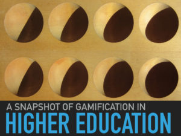
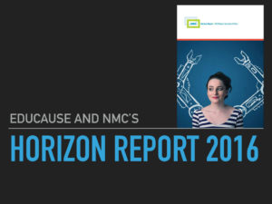
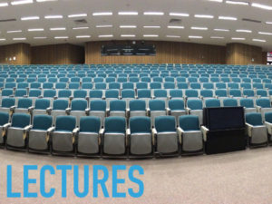
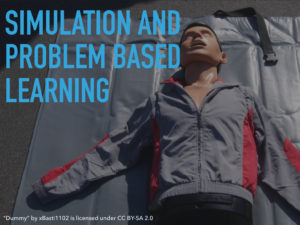
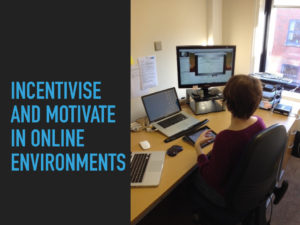
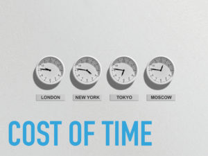
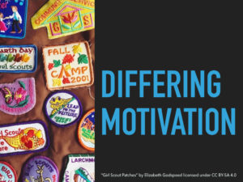

## References and resources

# Games and Gamification for Learning and eLearning

Talk given at the Brighton Gamification Meetup on the 9th of March, 2016. [http://www.meetup.com/Brighton-Gamification-Meetup/events/226393358/](http://www.meetup.com/Brighton-Gamification-Meetup/events/226393358/)

<table style="height: 901px;" width="800"><tbody><tr><td>&nbsp;</td><td>Image source: image of Awele board game by rkit on <a href="https://pixabay.com/en/awele-board-game-game-board-play-1007635/" target="_blank" rel="noopener noreferrer">Pixabay (image link)</a>. CC0 Public domain.</td></tr><tr><td>&nbsp;</td><td>Image source: @NMCorg on Twitter. Original Tweet embedded below. Main page for archived NMC reports: <a href="http://www.nmc.org/publication-type/horizon-report/" target="_blank" rel="noopener noreferrer">http://www.nmc.org/publication-type/horizon-report/</a> Reports referenced in presentation: Johnson, L., Adams Becker, S., Cummins, M., Estrada, V., Freeman, A., and Hall, C. (2016). <em>NMC Horizon Report: 2016 Higher Education Edition.&nbsp;</em>Austin, Texas: The New Media Consortium. Direct link: <a href="http://cdn.nmc.org/media/2016-nmc-horizon-report-he-EN.pdf" target="_blank" rel="noopener noreferrer">http://cdn.nmc.org/media/2016-nmc-horizon-report-he-EN.pdf</a> 2015: <a href="http://cdn.nmc.org/media/2015-nmc-horizon-report-HE-EN.pdf" target="_blank" rel="noopener noreferrer">http://cdn.nmc.org/media/2015-nmc-horizon-report-HE-EN.pdf </a>2014: <a href="http://cdn.nmc.org/media/2014-nmc-horizon-report-he-EN-SC.pdf" target="_blank" rel="noopener noreferrer">http://cdn.nmc.org/media/2014-nmc-horizon-report-he-EN-SC.pdf</a> 2013: <a href="http://www.nmc.org/pdf/2013-horizon-report-HE.pdf" target="_blank" rel="noopener noreferrer">http://www.nmc.org/pdf/2013-horizon-report-HE.pdf</a> 2012: <a href="http://www.nmc.org/pdf/2012-horizon-report-HE.pdf" target="_blank" rel="noopener noreferrer">http://www.nmc.org/pdf/2012-horizon-report-HE.pdf</a> Linden Research, Inc. (2016). Second Life [Computer software]. Retrieved from <a href="http://secondlife.com/" target="_blank" rel="noopener noreferrer">http://secondlife.com/</a></td></tr><tr><td>&nbsp;</td><td>Image source: image of auditorium by ISDiva on <a href="https://pixabay.com/en/auditorium-classroom-lecture-572776/" target="_blank" rel="noopener noreferrer">Pixabay (image link)</a>. CC0 Public domain. Kahoot. (2016). Kahoot [Computer software]. Retrieved from <a href="https://getkahoot.com/" target="_blank" rel="noopener noreferrer">https://getkahoot.com/</a> Poll Everywhere. (2016). Poll Everywhere [Computer software]. Retrieved from <a href="https://www.polleverywhere.com" target="_blank" rel="noopener noreferrer">https://www.polleverywhere.com</a> Nearpod. (2016). Nearpod [Computer software]. Retrieved from <a href="http://www.nearpod.com" target="_blank" rel="noopener noreferrer">http://www.nearpod.com</a> Additional related links: Dr Rachel Knight from City University London on using Poll Everywhere. Video: <a href="http://mediaspace.city.ac.uk/media/Leading+by+Example+-+Dr+Rachael-Anne+Knight+Poll+Everywhere+/1_la0re03s" target="_blank" rel="noopener noreferrer">http://mediaspace.city.ac.uk/media/Leading+by+Example+-+Dr+Rachael-Anne+Knight+Poll+Everywhere+/1_la0re03s</a> Associated blog post: <a href="https://blogs.city.ac.uk/educationalvignettes/2015/12/10/audience-response-using-poll-everywhere/#.VsG6neZWkVQ" target="_blank" rel="noopener noreferrer">https://blogs.city.ac.uk/educationalvignettes/2015/12/10/audience-response-using-poll-everywhere/#.VsG6neZWkVQ</a> Jayne Morgan, Senior Lecturer in Diagnostic Radiography at City University London on using Poll Everywhere: <a href="http://mediaspace.city.ac.uk/media/Leading+by+Example+-+Jayne+Morgan+Poll+Everywhere/1_9l0kq2d1" target="_blank" rel="noopener noreferrer">http://mediaspace.city.ac.uk/media/Leading+by+Example+-+Jayne+Morgan+Poll+Everywhere/1_9l0kq2d1</a> Special thanks to Santanu Vasant for sharing these resources. Moscrop, C. (2015). Improving student engagement in lectures through the use of free mobile applications. <em>Proceedings of the 7th International Conference on Education and New Learning Technologies, Barcelona, Spain</em> (EDULEAN15). Retrieved from <a href="http://repository.edgehill.ac.uk/6922/1/EDULEARN15_-_MOSCROP.doc" target="_blank" rel="noopener noreferrer">http://repository.edgehill.ac.uk/6922/1/EDULEARN15_-_MOSCROP.doc</a></td></tr><tr><td><strong>&nbsp;Text message gamified quiz system slide</strong></td><td>Reimers, S. (2015). Text message gamified quiz system [Computer software]. Dr. Stian Reimer's website (Dept. of Psychology, City University London): <a href="http://www.reimers.co.uk/index.html" target="_blank" rel="noopener noreferrer">http://www.reimers.co.uk/index.html</a></td></tr><tr><td>&nbsp;</td><td>“<a href="https://flic.kr/p/8CPgSP" target="_blank" rel="noopener noreferrer">Dummy</a>” by <a href="https://www.flickr.com/photos/xbasti1102/" target="_blank" rel="noopener noreferrer">xBasti1102</a> is licensed under <a href="https://creativecommons.org/licenses/by-sa/2.0/" target="_blank" rel="noopener noreferrer">CC BY-SA 2.0</a> BBC (2011, December 11). The apprentice used by Brighton students. <i>BBC Sussex</i>. Retrieved from http://www.bbc.co.uk/news/uk-england-sussex-16130509 Clouston, T., Westcott, L., &amp; Whitcombe, S. W. (Eds.). (2010). <i>Problem based learning in health and social care</i>. United Kingdom: Wiley-Blackwell (an imprint of John Wiley &amp; Sons Ltd). Schild, E. O., &amp; Boocock, S. S. (Eds.). (1968). <i>Simulation games in learning</i>. Retrieved from http://eric.ed.gov/?id=ED026857 Jisc Digital Student Case Exemplars: <a href="http://digitalstudent.jiscinvolve.org/wp/exemplars/" target="_blank" rel="noopener noreferrer">http://digitalstudent.jiscinvolve.org/wp/exemplars/</a> "A space to play with 'disruptive' technologies for learning" about Coventry University's Disruptive Media Learning Lab: <a href="http://digitalstudent.jiscinvolve.org/wp/files/2015/02/DS15-A-space-to-play-with-disruptive-technologies-for-learning.pdf" target="_blank" rel="noopener noreferrer">http://digitalstudent.jiscinvolve.org/wp/files/2015/02/DS15-A-space-to-play-with-disruptive-technologies-for-learning.pdf</a> The Sussex SImulation hub blog site: <a href="http://blogs.brighton.ac.uk/simulationhub/" target="_blank" rel="noopener noreferrer">http://blogs.brighton.ac.uk/simulationhub/</a> Problem-based learning at University of Brighton: Sue Greener: <a href="http://about.brighton.ac.uk/bbs/contact/details.php?uid=slg" target="_blank" rel="noopener noreferrer">http://about.brighton.ac.uk/bbs/contact/details.php?uid=slg</a> Gaynor Sadlo: <a href="http://brighton.academia.edu/GaynorSadlo" target="_blank" rel="noopener noreferrer">http://brighton.academia.edu/GaynorSadlo</a> Sadlo, G. (2014). Creating interactive multi-media Problem-Based Learning cases to enhance student cognition. <i>Evolving experiences: Articles from the learning and teaching conference: 2013</i>. 36-47. Available at: <a href="http://about.brighton.ac.uk/clt/publicationsclt/" target="_blank" rel="noopener noreferrer">http://about.brighton.ac.uk/clt/publicationsclt/</a> Willmer, M., Stanley, H., &amp; Cheales, C. (2014). The Apprentice – you’re hired!. <i>Evolving experiences: Articles from the learning and teaching conference: 2013</i>. 68-75. Available at: <a href="http://about.brighton.ac.uk/clt/publicationsclt/" target="_blank" rel="noopener noreferrer">http://about.brighton.ac.uk/clt/publicationsclt/</a></td></tr><tr><td>&nbsp;</td><td>Csikszentmihalyi, M. (1990). <i>Flow: The psychology of optimal experience</i>. New York: HarperCollins Publishers. De Freitas, S. (2006). <i>Learning in Immersive worlds A review of game-based learning prepared for the JISC e-learning Programme learning in Immersive worlds: A review of game-based learning</i>. Retrieved from <a href="http://www.webarchive.org.uk/wayback/archive/20140615100504/http://www.jisc.ac.uk/media/documents/programmes/elearninginnovation/gamingreport_v3.pdf" target="_blank" rel="noopener noreferrer">http://www.webarchive.org.uk/wayback/archive/20140615100504/http://www.jisc.ac.uk/media/documents/programmes/elearninginnovation/gamingreport_v3.pdf</a> FutureLearn. (2016, April 18). <i>Introduction to forensic science</i>. Retrieved March 7, 2016, from <a href="https://www.futurelearn.com/courses/introduction-to-forensic-science" target="_blank" rel="noopener noreferrer">https://www.futurelearn.com/courses/introduction-to-forensic-science</a> Kapp, K. M. (2012). <i>The gamification of learning and instruction: Game-based methods and strategies for training and education</i>. San Francisco, CA: Wiley, John &amp; Sons. Macdonald, K. (2014, January 6). CSI Scotland: Learning lessons from an online murder mystery. <i>BBC Glasgow &amp; West Scotland</i>. Retrieved from <a href="http://www.bbc.co.uk/news/uk-scotland-glasgow-west-25621746" target="_blank" rel="noopener noreferrer">http://www.bbc.co.uk/news/uk-scotland-glasgow-west-25621746</a>
Williamson Shaffer, D., Squire, K. R., Halverson, R., &amp; Gee, J. P. (2005). Video Games and the Future of Learning. <em>Phi Delta</em>

<em>Kappan</em>, <em>87</em>(02), 104-111. Retrieved from <a href="http://website.education.wisc.edu/~kdsquire/tenure-files/23-pdk-VideoGamesAndFutureOfLearning.pdf" target="_blank" rel="noopener noreferrer">http://website.education.wisc.edu/~kdsquire/tenure-files/23-pdk-VideoGamesAndFutureOfLearning.pdf</a>

Whitton, N. (2016, February 22). <i>The importance of play: What universities can learn from preschools</i>. Retrieved March 7, 2016, from <a href="https://theconversation.com/the-importance-of-play-what-universities-can-learn-from-preschools-53007" target="_blank" rel="noopener noreferrer">https://theconversation.com/the-importance-of-play-what-universities-can-learn-from-preschools-53007</a>

</td></tr><tr><td><strong>Librarygame slide</strong></td><td>Gamification for public and academic libraries. (2015). Retrieved March 7, 2016, from <a href="http://librarygame.co.uk/index.html" target="_blank" rel="noopener noreferrer">http://librarygame.co.uk/index.html</a> Lemontree - university of Huddersfield. Retrieved March 7, 2016, from https://library.hud.ac.uk/lemontree/about.php OpenTree. (2016). Retrieved March 7, 2016, from <a href="http://www.open.ac.uk/library/opentree/about" target="_blank" rel="noopener noreferrer">http://www.open.ac.uk/library/opentree/about</a>
Tay, A., &amp; profile, V. my complete. (2009). <i>Musings about librarianship</i>. Retrieved March 7, 2016, from http://musingsaboutlibrarianship.blogspot.co.uk/2012/01/adding-social-gamification-to-library.html
</td></tr><tr><td>&nbsp;</td><td>Image source: image of analytics by StockSnap on <a href="https://pixabay.com/en/analytics-charts-traffic-marketing-925379/" target="_blank" rel="noopener noreferrer">Pixabay (image link)</a>. CC0 Public domain. McGonigal, J. (2012). <i>Reality is Broken: Why Games Make Us Better and How They Can Change the World</i>. London: Vintage. Sclater, N. (2015, April 29). <i>What do students want from a learning analytics app?</i>. Retrieved March 8, 2016, from http://sclater.com/blog/what-do-students-want-from-a-learning-analytics-app/ Chou, Y.-K. (2015). <i>Actionable Gamification: Beyond points, badges and Leaderboards</i>. United States: Createspace Independent Publishing Platform.</td></tr><tr><td>&nbsp;<strong>Wireframes slide</strong></td><td>McGonigal, J. (2012). <i>Reality is Broken: Why Games Make Us Better and How They Can Change the World</i>. London: Vintage. Sclater, N. (2015, April 29). <i>What do students want from a learning analytics app?</i>. Retrieved March 8, 2016, from http://sclater.com/blog/what-do-students-want-from-a-learning-analytics-app/ Chou, Y.-K. (2015). <i>Actionable Gamification: Beyond points, badges and Leaderboards</i>. United States: Createspace Independent Publishing Platform.</td></tr><tr><td>&nbsp;</td><td>Image source: image of wood by Stux on <a href="https://pixabay.com/en/wood-goal-barn-old-input-boards-1086486/" target="_blank" rel="noopener noreferrer">Pixabay (image link)</a>. CC0 Public domain. Using gamification elements with careful planning but not necessarily with lots of technology involved. Hannah Frith staff profile: <a href="http://about.brighton.ac.uk/staff/details.php?uid=hlf10" target="_blank" rel="noopener noreferrer">http://about.brighton.ac.uk/staff/details.php?uid=hlf10</a> Gordon, N., Brayshaw, M., &amp; Grey, S. (2013). Maximising gain for minimal pain: Utilising natural game mechanics. <i>Innovation in Teaching and Learning in Information and Computer Sciences</i>, <i>12</i>(1), 27–38. doi:10.11120/ital.2013.00004 Available at: <a href="http://www.tandfonline.com/doi/pdf/10.11120/ital.2013.00004" target="_blank" rel="noopener noreferrer">http://www.tandfonline.com/doi/pdf/10.11120/ital.2013.00004</a></td></tr><tr><td>&nbsp;</td><td>Image source: image of business time clocks by jarmoluk on <a href="https://pixabay.com/en/business-time-clock-clocks-257911/" target="_blank" rel="noopener noreferrer">Pixabay (image link)</a>. CC0 Public domain. Scramboo. (2016). Playmaker [Computer software]. Retrieved from <a href="http://scramboo.com/playmaker" target="_blank" rel="noopener noreferrer">http://scramboo.com/playmaker</a> Actionbound. (2016). Actionbound [Computer software]. Retrieved from <a href="http://blogs.brighton.ac.uk/actionbound/" target="_blank" rel="noopener noreferrer">http://blogs.brighton.ac.uk/actionbound/</a> Try and Actionbound: <a href="http://blogs.brighton.ac.uk/actionbound/try-it-out/" target="_blank" rel="noopener noreferrer">http://blogs.brighton.ac.uk/actionbound/try-it-out/</a></td></tr><tr><td>&nbsp;</td><td>&nbsp;“<a href="https://commons.wikimedia.org/wiki/File:Girl_Scout_Patches.png" target="_blank" rel="noopener noreferrer">Girl Scout Patches</a>” by Elizabeth Godspeed licensed under <a href="https://creativecommons.org/licenses/by-sa/4.0/deed.en" target="_blank" rel="noopener noreferrer">CC BY-SA 4.0</a> Computer Gamification and instruction - university of hull. (2015, October 19). Retrieved March 9, 2016, from <a href="http://www2.hull.ac.uk/science/computer-science/research/cgi.aspx" target="_blank" rel="noopener noreferrer">http://www2.hull.ac.uk/science/computer-science/research/cgi.aspx</a> Welcome to the serious games institute. (2016, July 21). Retrieved March 9, 2016, from <a href="http://www.seriousgamesinstitute.co.uk/" target="_blank" rel="noopener noreferrer">http://www.seriousgamesinstitute.co.uk/</a> &nbsp; &nbsp;</td></tr><tr><td>&nbsp;</td><td><strong>Playful Learning Conference, Manchester, 13-15 July, 2016 [registration still open]: <a href="http://conference.playthinklearn.net/blog/" target="_blank" rel="noopener noreferrer">http://conference.playthinklearn.net/blog/</a></strong> SEE ALTC game for example a GLSIG project: <a href="https://www.linkedin.com/pulse/playing-conference-altcgame-rosie-jones" target="_blank" rel="noopener noreferrer">https://www.linkedin.com/pulse/playing-conference-altcgame-rosie-jones</a> Spotlight on Digital Capabilities 2: <a href="http://www.ucisa.ac.uk/groups/dsdg/Events/2016/digcaps.aspx" target="_blank" rel="noopener noreferrer">http://www.ucisa.ac.uk/groups/dsdg/Events/2016/digcaps.aspx</a> Other links of interest: Games and Learning Society (US): <a href="http://gameslearningsociety.org/" target="_blank" rel="noopener noreferrer">http://gameslearningsociety.org/</a> European Conference on Games Based Learning 6-7th October 2016, Paisley, Scotland: <a href="http://www.academic-conferences.org/conferences/ecgbl/" target="_blank" rel="noopener noreferrer">http://www.academic-conferences.org/conferences/ecgbl/</a> The CUNY Games Network: <a href="http://games.commons.gc.cuny.edu/" target="_blank" rel="noopener noreferrer">http://games.commons.gc.cuny.edu/</a></td></tr></tbody></table>

 

<blockquote class="twitter-tweet" data-partner="tweetdeck">
IT'S HERE! Announcing NMC Horizon Report 2016 HiEd Edition w/ <a href="https://twitter.com/EDUCAUSELI">@EDUCAUSELI</a>: <a href="https://t.co/unGgoOAMLF">https://t.co/unGgoOAMLF</a> <a href="https://twitter.com/hashtag/NMChz?src=hash">#NMChz</a> <a href="https://twitter.com/hashtag/ELI2016?src=hash">#ELI2016</a> <a href="https://t.co/hUXtbEol3P">pic.twitter.com/hUXtbEol3P</a>
— New Media Consortium (@NMCorg) <a href="https://twitter.com/NMCorg/status/695231600162766849">February 4, 2016</a></blockquote>

