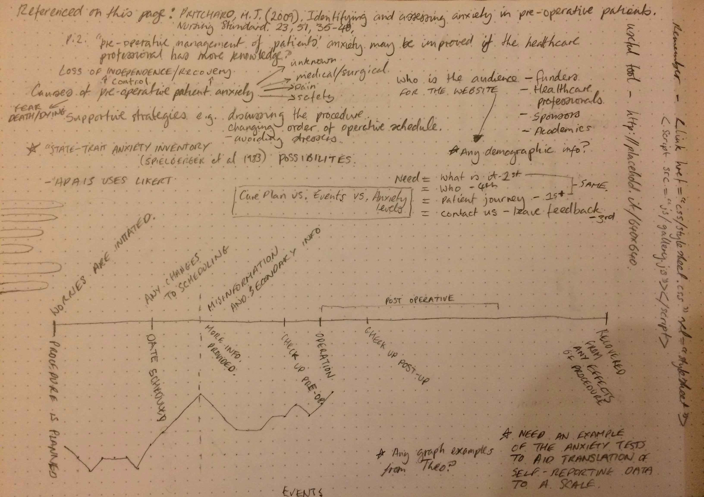
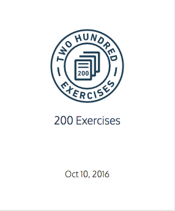
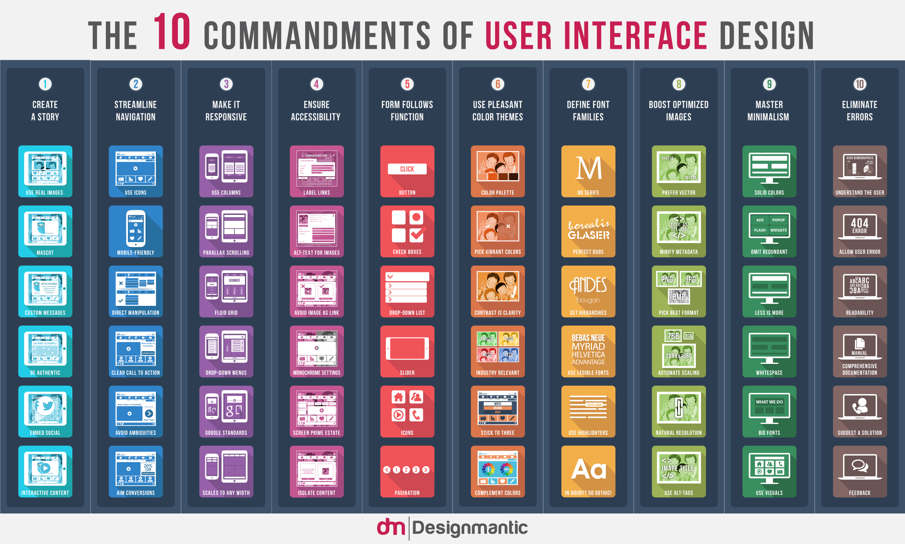

Over the past three weeks since the start of the module, I have been working away on the development of my portfolio site concept and gaining domain knowledge to support the development process. I have found myself in a situation where I have been torn between completing the UX procedures and design artefacts that I learned about and implemented during previous modules and starting to code. It is like standing at the edge of an exciting, and slightly daunting, precipice wondering whether to make the leap. The good news is, I am close. I must also at this point, state that I aim to make a real and useful website. It will be short and sweet but it will, hypothetically at least, fulfill a real-world purpose. I also hope that it will be possible to use the site to support future research work that I plan to undertake.

### Process: A minimalist approach influenced by LEAN UX

I have found that I cannot bypass the UX design artefacts and documentation entirely as they have become part of the fundamental fabric of my thought processes! So I have decided to complete a very stripped down version, to ensure that I have a solid architectural foundation for what I am about to build. This approach will be composed of the following elements.

1. A concept document in a bare bones form aka this journal entry!
2. Task scenarios - [this document](https://docs.google.com/document/d/1Nxisu8BaAGM3iaJ1r7oZv4b-XAM59ZMapdnNgK0rQzc/edit "a long link to a Google document viewer") is the first version.
3. Business Model Canvas<fn> Business Model Canvas ([http://www.businessmodelcanvas.com](http://www.businessmodelcanvas.com)), licensed under Creative Commons Attribution-Share Alike 3.0 Unported licenses ([http://creativecommons.org/licenses/by-sa/3.0/](http://creativecommons.org/licenses/by-sa/3.0/)).</fn> - an artefact template that I found via Cao & Bank's, _The Guide to UX Design Process & Documentation_ (n.d.). This will be in a forthcoming journal entry.
4. General characteristics for user groups - this will also be in a forthcoming journal entry. Due to time contraints and available information, it is not possible to build thorough characteristics lists for all potential users. I am however, fortunate to have a real stakeholder who can provide feedback on my work and it's hypothetical usefulness. (more on this later on in this entry).
5. \[Tentative plan\] create a UML<fn>Unified Modeling Language - more information at wikipedia: [https://en.wikipedia.org/wiki/Unified\_Modeling\_Language](https://en.wikipedia.org/wiki/Unified_Modeling_Language)</fn> diagram to ensure that each page and section of the site includes the correct information and functions. I personally find UML diagrams to be very helpful for archictectural planning. It can be a fairly basic model for this project, but I do find that the process of making the models uncovers things that you haven't thought about! I may find that this isn't needed, but I won't know until I start making it.
6. A paper prototype - as I am working with a real stakeholder, I want to show him something quick and easy so that he can visualise the concept and ensure that my representation and approach to the domain is accurate. I think that a paper prototype is the best way to do that, in order to move to the coding phase as quickly as possible.

### Concept

The wait is over! Here is the concept. The project's working title is _p__atient pre-op anxiety infographic._ It is a website structured around a central page, which leads the viewer through a fictional narrative of a patient's experience of anxiety while awaiting a medical operation or procedure. In the narrative the patient will be using an electronic wearable device to track their own vital signs and also for logging their anxiety levels - the influence of this countermeasure will be explored. The narrative is represented through a navigable timeline enriched with the use of graphical, written and statistical information. The underlying project, to use wearable devices to measure patient pre-operative anxiety is attributed to and courtesy of Dr. Theofanis Fotis (School of Health Sciences, University of Brighton), whom I am collaborating with at this time. **Scope** The _p__atient pre-op anxiety infographic_ will:

- deliver an approachable overview of a research project - the proposed research project is to design a user interface for a medical wearable device to measure anxiety;
- explain the issues that can result from pre-operative stress in patients;
- provide a point of entry for those with little or no knowledge of the subject as well as explain the potential benefits of the project to experienced medical professionals.

The _p__atient pre-op anxiety infographic_ will not:

- provide indepth medical information;
- provide any fully formed solutions or recommendations for implementation of wearable devices in a medical setting;
- provide advice or suggestions for the production of patient care plans. As a narrative scenario it is exploring a hypothetical scenario in which a wearable device is used.

**Benefits** The _p__atient pre-op anxiety infographic_ will provide the following benefits:

- it will provide a valuable resource for explaining the research project to potential funders and future stakeholders;
- it will help to raise awareness of the potential issues related to patient pre-operative anxiety;
- it will highlight potential ways that increased knowledge of a patient's vital signs and self-reported anxiety could improve patient care;
- it will provide an accompanying contextual information for the proposed future interface design project;
- it will be a publicity tool, that can be used to explain the project within the academic and medical online communities.

**Goals** The following goals are related to the successful creation of the _p__atient pre-op anxiety infographic:_

- provide a valuable portfolio piece, not only in terms of web development, but also as a tool for the research team and collaborators;
- contribute to the approval and ethics approval of this as a concept for F.MacNeill's final graduating project;
- stimulate dialogue around the issues and ideas raised by the _p__atient pre-op anxiety infographic;_
- encourage potential funders and stakeholders to invest in the project.

**Objectives**

- Create an accurate portrayal of a possible patient care scenario.
- Provide information highlighting the benefits of the proposed project.
- Pose the project concept as an open question in order to gauge feedback and interest from the medical community and potential funders and/or stakeholders.
- The user audiences for this are diverse but have one thing in common, they have very limited time to engage with a website of this kind. This website should take no longer than 10-15mins to navigate, the equivalent of a typical coffee/tea break.
- To be shared via social media between interested parties.
- To be adaptive and easily viewed and navigated on mobile devices.
- To be accessible to those on older web browsers (as far as possible).
- To be accessible to users with disabilities, allowing for personal customisation (as far as possible).

**The Research Team** Right now this is just me, however Dr. Fotis has agreed to review the materials and my hope is that if the site meets his approval then we will be able to use it to promote the real project. In the first instance it is a hypothetical project site, but that doesn't mean that you cannot aim high as I have outlined in the objectives above. **Audience** More detail on this in a future entry. The user groups are: funding review panel members, academic staff at multiple Higher Education Institutions (HEIs), medical professionals. **Stakeholders** Intially Dr. Fotis is the main stakeholder, however I would take this site forward as evidence to support my final project proposal. In that sense academic staff in the School of Computing are also future stakeholders.

### Research of the domain and existing websites

I have been using my [Trello project board](https://trello.com/b/4a20fYpf/web-development-portfolio-project) as a place to collect links and resources. On the one hand I have been looking at the specs for potential wearable devices, it is out of scope to suggest an actual solution but I would like to supply some possibilities in terms of device form so that the project is tangible. I have also been reviewing materials that Dr. Fotis provided to help gain domain knowledge of a patient's pre-operative experience. I have listed these sources in my reference list below.  Sketch of patient journey ideas **Existing websites** As a general observation medical websites tend to be firmly on the utilitarian end of the scale. This is understandable as information is usually important and needs to be delivered quickly. So it will be important to strike a balance between something eye-catching, which is also substantive. Here is are few examples that I came across and wrote notes about (transferred from my trello board). `-----------------Notes/Observations---------------` This collection of timeline based websites and infographics is really helpful: [http://www.hongkiat.com/blog/timeline-in-web-design/](http://www.hongkiat.com/blog/timeline-in-web-design/) Some of the examples are a bit old and don't work as well in contemporary browsers. This is something to consider. Most of these sites are in a long-form vertical format. This is great and modern, but considering the audio for this site, this obscures some key aspects of the journey. Viewers will be time-pressured and need to see the journey/timeline elements as succinctly as possible. The following sites are closest to what I want to design: [http://rodania.com/about](http://rodania.com/about) This example is not very responsive, so that would be something to consider. [http://minimalmonkey.com/](http://minimalmonkey.com/) This blog is quite nice but the scrolling right function would need to be made much more obvious.

* * *

Vertical timeline examples: I like the intro page segment on this one: [http://www.akita.co.uk/computing-history/](http://www.akita.co.uk/computing-history/) It isn't keyboard navigable though which is not great in terms of my accessibility goals. This one is keyboard navigable and it aesthetically simple and user-friendly:[https://uk.protectyourbubble.com/iphone-timeline/#iphone-2](https://uk.protectyourbubble.com/iphone-timeline/#iphone-2) I quite like the simplicity of this one, it is text heavy, but it gets the message across quickly: [https://mixpanel.com/about/](https://mixpanel.com/about/) I like the use of months on the timeline on this portfolio site, although accessibility and control might be an issue here: [http://www.czk.fr/](http://www.czk.fr/)

* * *

A collection of horizontal scrolling sites: [https://webdesignledger.com/40-of-the-best-horizontal-scrolling-websites/](https://webdesignledger.com/40-of-the-best-horizontal-scrolling-websites/)

> Many of these are quite old or have changed format since the post was written. **I found myself considering a horizontal layout due to the need to display data and the need for it to be readable, however horizontal layouts pose some real accessibility and navigation issues.**

* * *

Recently updated list of infographics, including many interactive examples: [http://www.siegemedia.com/creation/best-infographics](http://www.siegemedia.com/creation/best-infographics) An oldie, but a goodie "The Evolution of the Web" as an example of a horizontal layout: [http://www.evolutionoftheweb.com/#/evolution/day](http://www.evolutionoftheweb.com/#/evolution/day) ...and some justification for my concept! 13 Reasons Why Your Brain Craves Infographics: [http://neomam.com/interactive/13reasons/](http://neomam.com/interactive/13reasons/)

* * *

This site uses the [Knightlab's Timeline JS tool](https://timeline.knightlab.com/), which I have used many times, mostly in WordPress sites. This is a nice medical example, but I want something a bit more contemporary: [http://www.centenary.mrc.ac.uk/](http://www.centenary.mrc.ac.uk/)

> This site has the kind of section feel that I am looking for, although I still wonder how I can visualise anxiety in a vertical layout versus horizontal: [http://www.kocha.com.au/](http://www.kocha.com.au/) This site has nice comment mark-up and makes clear use of the <section> element.

`-----------------End--of--Notes/Observations---------------`

### Journal development

A quick run down of learning journal development activities. A full rundown can be found on my github development page, I have added a handy link to to this in the "social menu" on the right-hand footer of this journal site (circular icon with octo-cat logo). **Created an iframe embed in a widget for my trello board** so that I can display it in the sidebar. In order to create this I referred to: [http://jsfiddle.net/danlec/hmQJP/](http://jsfiddle.net/danlec/hmQJP/) and [https://developer.mozilla.org/en-US/docs/Web/HTML/Element/iframe](https://developer.mozilla.org/en-US/docs/Web/HTML/Element/iframe) Tomorrow I am attending a [WordPress Meet-up at Barclay's Eagle Lab](http://www.meetup.com/WordUp-Brighton/) in Brighton and as part of the event they will offer user testing. I thought why not add some functionality that I have always wanted to include AND get some tips. **I have added the option for visitors to this site to change the colour of the background (behind the text) for accessibility reasons.** I did this as by creating alternate child-theme style sheet and by installing the WP User Stylesheet Switcher plugin: [https://wordpress.org/plugins/wp-user-stylesheet-switcher/](https://wordpress.org/plugins/wp-user-stylesheet-switcher/). This idea is inspired by software like of Adobe Acrobat Pro and GoodReader App (for iPad) which allow you to customise background colours. I referenced [http://irlen.com](http://irlen.com) for colour-palette inspiration. Visual stress when reading and/or perception of colour contrast are reasons why a user might wish to alter background colours.

- hexidecimal colours used for initial function:
    - blue 1: #dfeced
    - blue 2: #9ab8fc
    - green 1: #a6f8e3
    - green 2: #aaf2a0
    - yellow 1: #ffff8f
    - yellow 2: #ffde75
    - purple: #bf95df

I'll write about any resulting feedback and actions on this site later. **I added Google Analytics code to my version of the header.php file**, this was not added to GitHub as it is specific to my version of the child theme. I decided against a plugin as I looked at a couple of options, but I didn't feel that having access to a Google Analytics data on the dashboard of WordPress was that important as compared to the account authorisation that plugins require to run (e.g. plugin that I looked at: [https://wordpress.org/plugins/google-analytics-dashboard-for-wp/](https://wordpress.org/plugins/google-analytics-dashboard-for-wp/)). I like to keep an eye on web traffic for security and publicity reasons.

### Coding practice

I have a Lynda.com course to wrap-up and I will post the details here when I finish. In the meantime, collectively I have now completed 200 exercises in Code Academy! I didn't do them all since the start of this module, but here is a screenshot of my badge! \[caption id="" align="alignnone" width="286"\] 200 Exercises badge from Code Academy profile\[/caption\] `--Just putting this here for later reference--found on my travels--`  Courtesy of: [Designmantic.com](https://www.designmantic.com/)

### References

Cao, J. & Bank, C. (n.d.). _The guide to UX design & documentation process._ Retrieved from [https://www.uxpin.com/studio/ebooks/guide-to-ux-design-process-and-documentation/](https://www.uxpin.com/studio/ebooks/guide-to-ux-design-process-and-documentation/) Gothelf, J. (2013). _Lean UX: Applying Lean Principles to Improve User Experience_ (1st ed.). United States: O’Reilly Media, Inc, USA. Prichard, M. J. (2009). Identifying and assessing anxiety in pre-operative patients. _Nursing Standard 23(_51), 25-40. Retrieved from [https://rcni.com/nursing-standard/](https://rcni.com/nursing-standard/) What can help relieve anxiety before surgery? (2014, May 21). In _PubMed Health_. Retrieved October 15, 2016, from [https://www.ncbi.nlm.nih.gov/pubmedhealth/PMH0072741/](https://www.ncbi.nlm.nih.gov/pubmedhealth/PMH0072741/)
