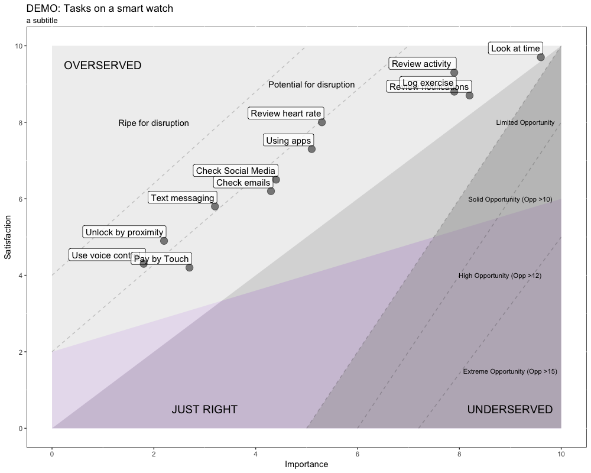
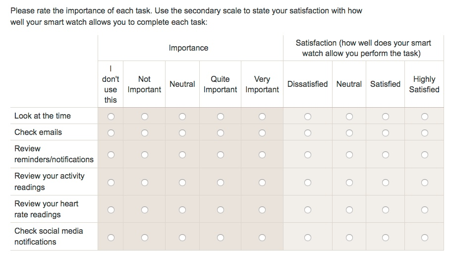
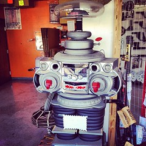
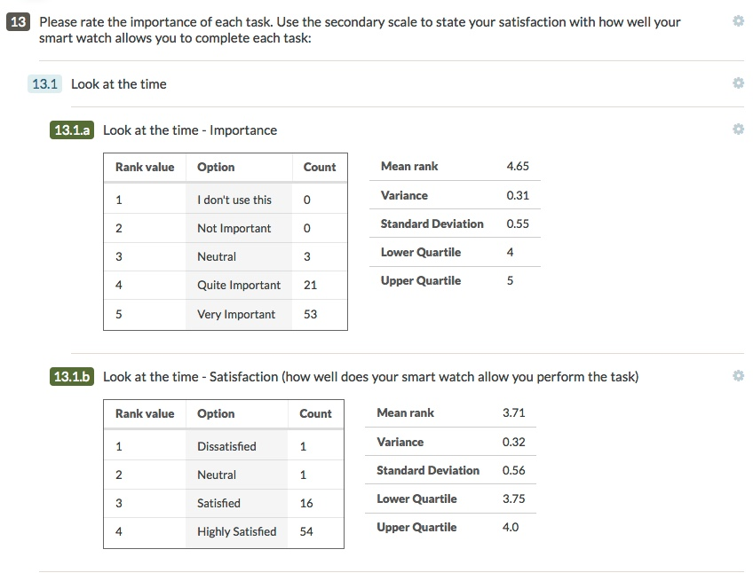
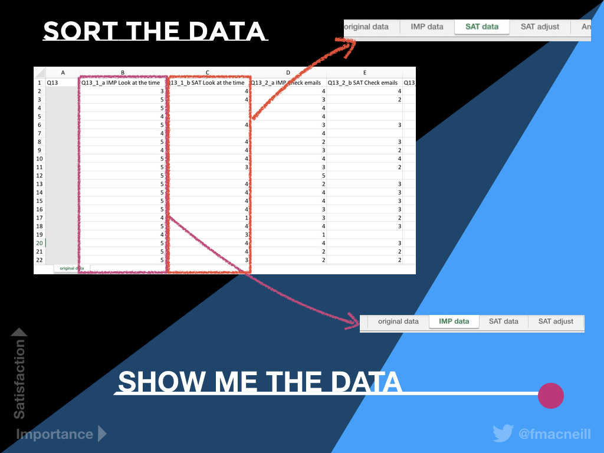
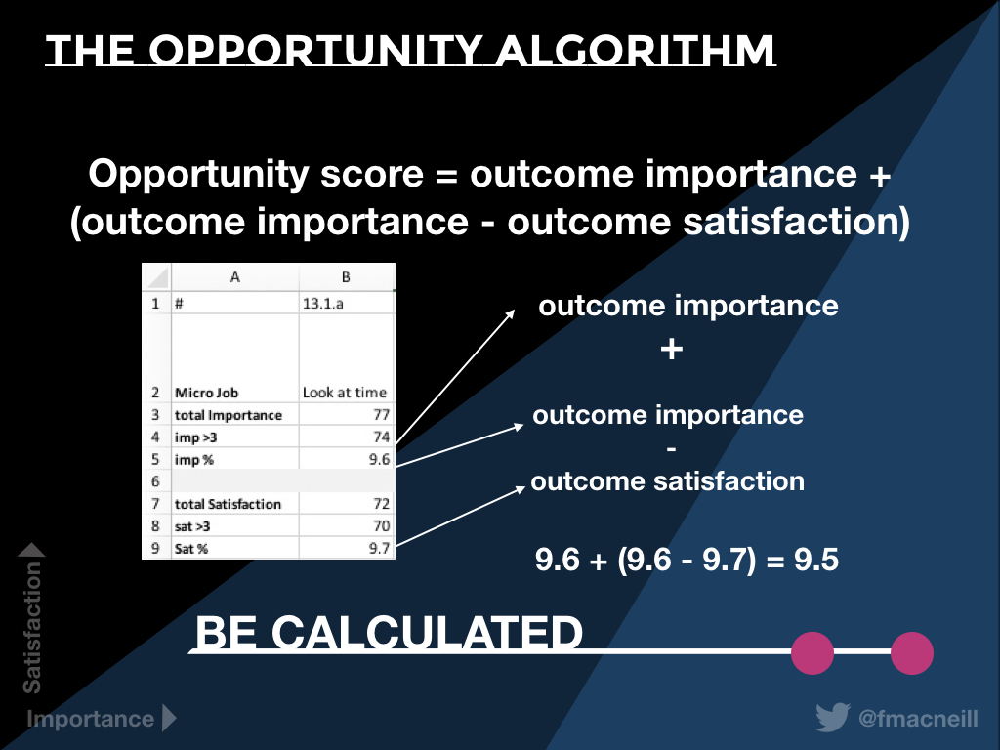
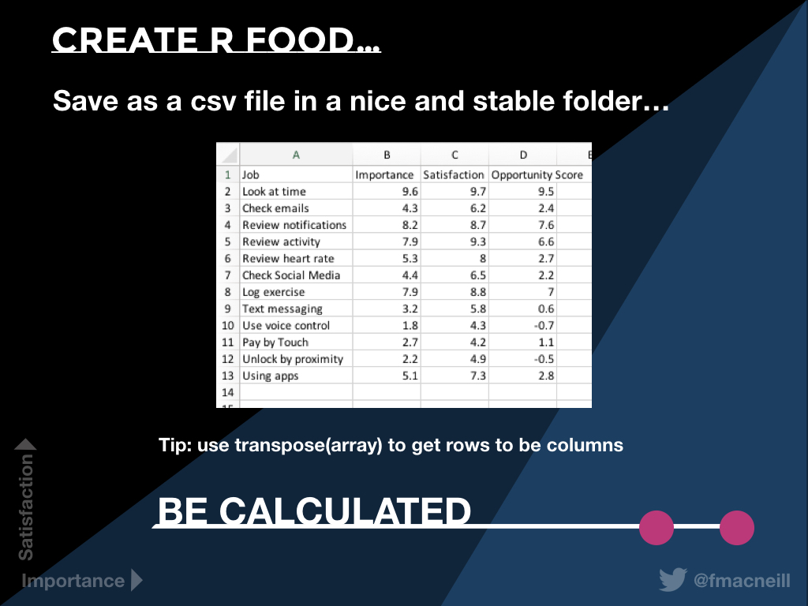
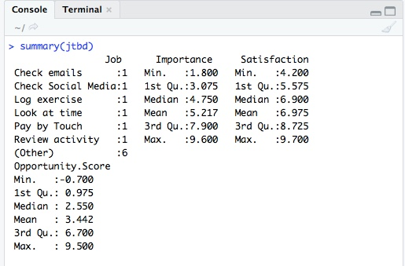
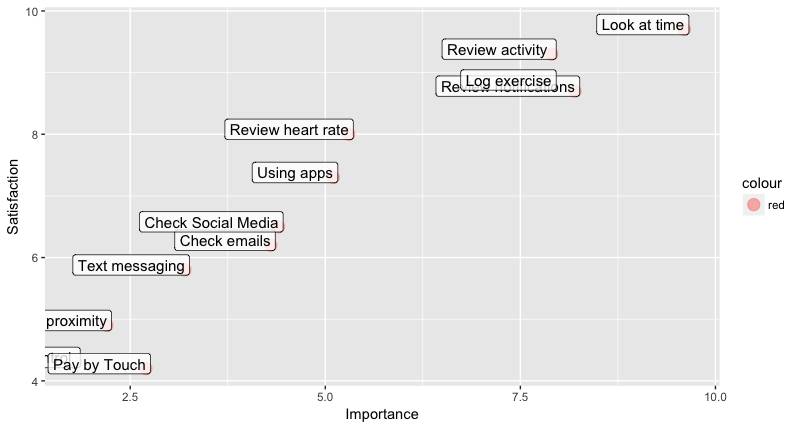

## Why am I here (as in you, at this blog, and reading this now)?

I hope you are here because you would like an introduction to using RStudio for data visualisation. I also hope that you are here because you are interested in [Jobs-To-Be-Done](https://strategyn.com/customer-centered-innovation-map/) (abbrev~ JTBD; Ulwick, 2016). This blog provides an example of how to apply one of the approaches that sits under the mantle of JTBD, an Opportunity Landscape (Ulwick, 2016; VIII. Target Hidden Growth Opportunities section).

## What are we going to do?

We are going to create a plot, or Opportunity Landscape (SEE also Ulwick, 2017), based on data from a quick opinion survey that was distributed via social media. Survey respondents were asked to rate particular tasks that they regularly complete on a smart watch according to importance and satisfaction on 5-part [Likert scales](https://en.wikipedia.org/wiki/Likert_scale). At this point I should add a caveat, for those familiar with JTBD. These questions were not based on full _job_ statements or stories but were abbreviated task statements. This is largely because based on survey testing, I found that the time it took to read and consider longer Job stories, based on Situation->Motivation->Expected Outcome (Klement, 2016) required too much mental effort for a <15min survey. I have found Job stories to be indispensable at the interview stage, when derived from transcripts as a means to uncover motivations. In the context of this post I would say that my methodology is a bit of a mash-up of JTBD and Gerry McGovern's top tasks (2010; 2017).

## Why are creating a plot?

I believe that the true purpose of any plot is to start conversations. Data visualisations have the power to both subvert truth and to challenge commonly held assumptions, I aim for the latter. Always.

## Why are we using RStudio with ggplot2?

The beauty of using RStudio with ggplot2 is...well beauty. Most people can make standard Excel visualisations without too much effort, but even with a lot of tweaking they still have a heady whiff. In the past I used Adobe Illustrator, but speaking of my own failings it was too easy to leave the land of accuracy and enter the land of surface-treatment. Here are my top reasons why you should consider using RStudio with ggplot2:

- You know how to use Microsoft Excel, but would like to create better visualisations...
- You have lots of data and you would like to segment it and look at a smaller portions without getting caught in a scrolling cycle-of-doom in a humongous spreadsheet...
- You want something inexpensive - the only cost here is time, but it is well worth it...
- Once you have built it, it can be used over and over and over...and tweaked quickly for whatever the need...
- **Bonus:** RStudio and gpplot2 can be used to prototype data visualisations for interface design and depending on your audience a realistic looking representation/visualisation could be very important.

If any of the statements above have piqued your interest then keep reading.

### Step 1: Collect the Data, Show me the Data

In true Blue Peter style, here is one I made earlier...

[](http://www.fionamacneill.co.uk/blog/wp-content/uploads/2018/03/JTBD_demo_image-1rd4pz7.png) The plot above is based on Webcredible's fantastic blog post on the topic of JTBD (Josephy, 2016).

I should add that your plots can be much more extravagant than this, but essentially this is the basic type of plot that we are going to create to get started. The descriptive lines above are superfluous[^1]. They are useful to keep commented-out in your code though as they can be used to create quick descriptive visuals for stakeholders when needed. What we can read from the visualisation above is that I could have asked about a lot more _jobs_; it is a bit sparse, but 12 jobs is what this particular survey could accommodate. Also the majority of the jobs fall into the 'overserved' domain. This means satisfaction has been rated higher than importance and according to Ulwick (2016) this is prime territory for disruption. So although initially, when I looked at this visualisation I was like "oh blast", as I was looking for some untapped potential related to smart watch jobs and there is none. Actually it is more that customers are overserved for jobs that aren't perceived as that important and therefore the landscape is primed for some new competitor to come in and do the job in a cheaper and perhaps less good, but cheaper way, which though market adoption and iteration of 'said' cheap version may eventually lead to something better (Ulwick, 2016). Of course another dimension would be to ask questions about jobs that have not yet been considered for smart watch, but these were out of scope for this particular survey. In a way this plot perfectly sums up smart watches as they are still finding their footing, they are still superfluous to the smartphone which is almost ubiquitous. The point I am getting to here is that this plot asks questions of the data, that we might not normally ask if we were looking at each question in isolation. It is only when we bring these jobs together that we reach a new level of meaning.

### Collect the data

You will need a survey question something like this... [](http://www.fionamacneill.co.uk/blog/wp-content/uploads/2018/03/00_display-w6adj4.jpg) ...Or split it into two versions of the same question depending on the allowances of your survey tool. **"DANGER, WILL ROBINSON!!!!"**

[](https://www.flickr.com/photos/garynlisa/8309044921/) A photo of a robot based on the character from the 1960s TV show, Lost in Space.

[DANGER WILL ROBINSON](https://www.flickr.com/photos/garynlisa/8309044921/)" ([CC BY 2.0](https://creativecommons.org/licenses/by/2.0/)) by [BasilLeaf](https://www.flickr.com/people/garynlisa/)

> Q: Hey didn't you say earlier that you need a 5 part Likert scale? But you only have four options in the 'satisfaction' scale above?

The answer is I had to take a difficult decision about the experience of users on smartphones using my survey. One more column and it was over the precipice into the land of non-function. As I am only interested in 'Quite Important' and 'Very Important' and 'Satisfied' and 'Highly Satisfied' in this context I sacrificed the final column. So the results for the first question looked like this... [](http://www.fionamacneill.co.uk/blog/wp-content/uploads/2018/03/00_result-qp4oul.jpg) For the Satisfaction element, I created an [IFS Function](https://support.office.com/en-us/article/IFS-function-36329a26-37b2-467c-972b-4a39bd951d45) in my final spreadsheet, to make 4 equaled 5, 3 equaled 4, 2 equaled 3 and 1 equaled 2. This put everything on the same scale.

### Download the data

Any good survey tool should allow you to download the results to CSV format (Comma Separated Values) and any survey tool worth its salt should also provide a SPSS or data analysis format which codes each response with a number. So in my case I wanted to the most positive response to have the highest rank value. I am going to use Excel to sort the data, as that is/was my comfort zone and I think that it is good to start from a position of confidence and trust in the original figures prior to visualising them. Personally speaking after only a few months of working with RStudio, I now feel happy to complete the entire workflow in RStudio.

**Tip: Split up your Importance (IMP) and Satisfaction (SAT) onto separate tabs in your Excel spreadsheet**

Believe me this will make your life SO much easier, when it comes to doing your calculations. [](http://www.fionamacneill.co.uk/blog/wp-content/uploads/2018/03/sort-the-data.001-1jk68l1.jpeg)

### Step 2: Do the Maths

Having separated your data, create a new tab in your spreadsheet and create the rows defined in the column labelled **A** below. Then use the data on your Importance tab to populate column **B.** Start with one question-worth of data, we'll get to the rest of your questions soon.

- So for row 3 "total importance": count all the entries in the importance column for that particular job from the first data row to the last - indicated by A_x_ \[COUNTA\].
- For row 4 we want to count how many of these entries had a rating of 4 (Quite Important) and 5 (Very Important). So we use a COUNTIF formula to look at values greater than 3. As we aren't dealing with decimals (yet), ">3" is accurate enough for this purpose.
- For row 5 we need to find out what percentage of overall responses are _Quite_ and _Very Important_. So we divide row 4 by row 3 and then times by 10.

<table style="border-color: #000000;" border="1px" cellspacing="0" cellpadding="0"><tbody><tr><td style="border-color: #000000;" valign="middle"><p align="center"><span style="font-family: Helvetica\ Neue; font-size: 12pt;"><b>1</b></span></p></td><td style="border-color: #000000;" valign="middle"><p align="center"><span style="font-family: Helvetica; font-size: 12pt;"><b>A</b></span></p></td><td style="border-color: #000000;" valign="middle"><p align="center"><span style="font-family: Helvetica; font-size: 12pt;"><b>B</b></span></p></td><td style="border-color: #000000;" valign="middle"></td></tr><tr><td style="border-color: #000000;" valign="middle"><p align="center"><span style="font-family: Helvetica\ Neue; font-size: 12pt;"><b>2</b></span></p></td><td style="border-color: #000000;" valign="middle"><span style="font-family: Helvetica; font-size: 12pt;"><b>Job</b></span></td><td style="border-color: #000000;" valign="middle"><span style="font-family: Helvetica; font-size: 12pt;"><i>I am a job</i></span></td><td style="border-color: #000000;" valign="middle"><span style="font-family: Helvetica; font-size: 12pt;"><i>In Excel speak</i></span></td></tr><tr><td style="border-color: #000000;" valign="middle"><p align="center"><span style="font-family: Helvetica\ Neue; font-size: 12pt;"><b>3</b></span></p></td><td style="border-color: #000000;" valign="middle"><span style="font-family: Helvetica; font-size: 12pt;"><b>total importance</b></span></td><td style="border-color: #000000;" valign="middle"><span style="font-family: Helvetica; font-size: 12pt;">How many entries are there in the column?</span></td><td style="border-color: #000000;" valign="middle"><span style="font-family: Helvetica; font-size: 12pt;">=COUNTA('IMP data’!A2:A<i>x</i>)</span></td></tr><tr><td style="border-color: #000000;" valign="middle"><p align="center"><span style="font-family: Helvetica\ Neue; font-size: 12pt;"><b>4</b></span></p></td><td style="border-color: #000000;" valign="middle"><span style="font-family: Helvetica; font-size: 12pt;"><b>imp &gt;3</b></span></td><td style="border-color: #000000;" valign="middle"><span style="font-family: Helvetica; font-size: 12pt;">How many entries are there in the column &gt;3?</span></td><td style="border-color: #000000;" valign="middle"><span style="font-family: Helvetica; font-size: 12pt;">=COUNTIF('IMP data'!A2:A<i>x</i>, "&gt;3")</span></td></tr><tr><td style="border-color: #000000;" valign="middle"><p align="center"><span style="font-family: Helvetica\ Neue; font-size: 12pt;"><b>5</b></span></p></td><td style="border-color: #000000;" valign="middle"><span style="font-family: Helvetica; font-size: 12pt;"><b>imp %</b></span></td><td style="border-color: #000000;" valign="middle"><span style="font-family: Helvetica; font-size: 12pt;">Importance/total importance<span class="Apple-converted-space">&nbsp; </span>X 10</span></td><td style="border-color: #000000;" valign="middle"><span style="font-family: Helvetica; font-size: 12pt;">=B4/B3*10</span></td></tr></tbody></table>

**Create identical rows for satisfaction** (after in my case, adjusting it upwards first, due to having a satisfaction scale of 4 parts), so that you end up with this...

### The Opportunity Algorithm

[](http://www.fionamacneill.co.uk/blog/wp-content/uploads/2018/03/presentation.001-28jxl4y.jpeg) So you will need a final row, row 10 to calculate the **Opportunity Score**. This is outlined above, but to explain the contents of the image. You take the outcome of importance, which is your percentage, so 9.6 in this case and take away the outcome of satisfaction, again a percentage. So that would leave you with -0.1, then add back on the outcome percentage which is is 9.6 and you end up with the total opportunity score of 9.5. outcome importance + (outcome importance - outcome satisfaction) = Opportunity Score 9.6 + (9.6 - 9.7) = 9.5 This is not the most exciting opportunity score, the most exciting ones are more than 10, or better yet more than 12. Oh and here is why I said that you should start with the formulae for one question-worth of data and to split Importance and Satisfaction onto separate sheets...Once you have created one column for Importance and Satisfaction data you can simply drag the formulae across all of your questions. 

<iframe src="https://www.youtube-nocookie.com/embed/C0V1I-bigQI?rel=0" width="560" height="315" frameborder="0" allowfullscreen="allowfullscreen"></iframe>

### Create R Food

Having done all that you need to get your data into columns for RStudio, specifically we want four columns to start off with: Job; Importance; Satisfaction; Opportunity; and Score. So that it looks like this... [](http://www.fionamacneill.co.uk/blog/wp-content/uploads/2018/03/becalculated.001-1mbcuiy.jpeg) Tip to get your data from rows to these columns use the transpose(array) function in Excel, here it is in action... 

<iframe src="https://www.youtube-nocookie.com/embed/sCdz2fOSWAI?rel=0" width="560" height="315" frameborder="0" allowfullscreen="allowfullscreen"></iframe>

### Step 3: Get Sta(R)ted

- **Install R from the R Archive:** Pick a mirror close-by (geographically speaking), e.g in UK - [University of Bristol](https://www.stats.bris.ac.uk/R/), [Imperial College London](https://cran.ma.imperial.ac.uk/)
- **Mac tip:** make sure that you check the MD5 hash and SHA hash match. You can do this quickly and easily in terminal.
    
    <iframe src="https://www.youtube-nocookie.com/embed/HHdrIlHS2-4?rel=0" width="560" height="315" frameborder="0" allowfullscreen="allowfullscreen"></iframe>
    
- **\[Mac only****\]** [XQuartz](https://www.xquartz.org/) Install - information about this is provided at R Archive above.
- **Install RStudio:** again do check the MD5. You can get the installer here - [https://www.rstudio.com/products/rstudio/download/#download](https://www.rstudio.com/products/rstudio/download/#download)

### Step 4: OoooH aRrrrr

Launch RStudio and have a go!

\[caption id="attachment\_909" align="alignnone" width="1164"\][](http://www.fionamacneill.co.uk/blog/wp-content/uploads/2018/03/RStudio-console-u9gkdl.jpg) Image of the RStudio UI\[/caption\]

So now that you have done all of the preparation you can actually start to create plots. Before you do anything else you need to load your library. In this case we are using ggplot2 which is part of [Hadley Wickham's (and others) Tidyverse](https://www.tidyverse.org/) - packages for R with standardised concepts and grammar. This is a good place to start as I have found that some of the R packages are quite idiosyncratic and it can take a bit of time to wrap your head around the internal logic, whereas the Tidyverse stuff all made a lot of sense. This could be because I originally learned to code in the JavaScript iteration of [Processing.](https://processing.org/) RStudio comes with a lot of packages already, so... 
```r
library(gpplot2)
```
If you needed to install it first and say you wanted the whole Tidyverse it would intuitively be... 

```r
install.packages(tidyverse)
```

Next you need to define your data and as you will recall we set that us as a .csv file on the desktop so lets call the data 'jtdb'... 

```r
library(gpplot2) jtbd <- read.csv("~/Desktop/JTBD\_R/jtbd.csv", header = T) 
#This is a comment in RMarkup, 
#so lets also find out about the data itself by using the summary function summary(jtbd) 
```

**Result in the console:** [](http://www.fionamacneill.co.uk/blog/wp-content/uploads/2018/03/resultinconsole-t8dbkw.jpg) Well...that is jolly helpful information!

### Now for the plot part:

```r
#the plot mapping - telling where your data to map on the axis 

ggplot(jtbd, aes(x=Importance, y=Satisfaction))+ 
# the "+" allows you to add another function, each function goes on its own layer, 
#so the order is important for example geom_point defines your data as points on the plot 

geom_point(color="blue", alpha=0.5, size=4)+ 

# To map aesthetics in a more intentional way - for instance adding labels, 
# we can use another function geom label which requires two variables 
#(in this case Importance and Satisfaction) 
# and tell it which column to get the labels from, in this case, the "Job" column 

geom_label(aes(label = jtbd$Job), 
nudge_y = 0.08, 
nudge_x = 0.06, 
hjust="right", 
alpha=0.8, 
size=4) 
```

This gives a starter plot like this... [](http://www.fionamacneill.co.uk/blog/wp-content/uploads/2018/03/star_R-244yio2.png) Just to prove that it is easy to get started I gave myself a little challenge... 

<iframe src="https://www.youtube-nocookie.com/embed/NJY0dQdV-7I?rel=0" width="560" height="315" frameborder="0" allowfullscreen="allowfullscreen"></iframe>

 After that it is really all about the aesthetics with this particular plot. Specifically I added a data.frame (a container for data) for each aesthetic element such as text, lines, shaded polygons and areas. These were then called as shown below... 
 
 ```r
 #Labels for the areas of the plot 
 
 labelover <- data.frame( x = 1, y = 9.5, label="OVERSERVED" ) 
 
 #Potential for disruption line 
 segment4 <- data.frame( x = 0, y = 2, xend = 7, yend = 10 ) 
 
 #further down in the code where the plot is created - I call these
 
 ggplot(jtbd, aes(x=Importance, y=Satisfaction)) + 
 
 #Calling the text 
 geom_text(data = labelover, 
 aes(x = x, y = y, label = label), size=5) + 
 
 #Calling the 'potential for disruption line' and adding some annotation to it 
 
 geom_segment(data = segment4, 
 aes(x = x, y = y, xend = xend, yend = yend), 
 alpha=0.2, linetype=2) + 
 annotate("text", x = 5.1, y = 9, label = "Potential for disruption")
 
 ```

### Step 5: Aesthetics

Well that provides an overview of the basics the rest will be based on your own aesthetic decisions. So I have provided the full code work-up with annotation below and recommend that you have a go and explore. Also if any of you are R and ggplot2 'pros' I am open to feedback as I am sure that it could be improved. To summarise, from my perspective using RStudio has provided the following benefits:

- A fast way to create reproducible visualisations of JTBD data
- An effective way to create prototype data visualisations for a range of design contexts
- An inexpensive option when compared to other data packages. Although I can get a student discount on software at the moment, I was thinking about the long term and developing a skill with an open source package
- It has helped me to think differently about data and to iterate visualisations in the same way that I would with other design projects
- It is immensely satisfying

## Further Reading:

* RStudio online learning materials: [https://www.rstudio.com/online-learning/#DataScience](https://www.rstudio.com/online-learning/#DataScience) 

* RMarkdown gallery for ideas: [https://rmarkdown.rstudio.com/gallery.html](https://rmarkdown.rstudio.com/gallery.html) 

* RStudio Cheatsheets (they taught me pretty much everything that I couldn't figure out from the built-in docs): [https://www.rstudio.com/resources/cheatsheets/](https://www.rstudio.com/resources/cheatsheets/) 

* Check out the Tidyverse: [https://www.tidyverse.org/](https://www.tidyverse.org/)

## References:

Josephy, J. (2016) 'Jobs to be done - a better way to innovate', _Webcredible blog_, 19 May. Available at: [https://www.webcredible.com/blog/may16-jobs-be-done-better-way-innovate/](https://www.webcredible.com/blog/may16-jobs-be-done-better-way-innovate/) (Accessed: 23 March 2018).

Klement, A. (2016) 'Designing features using job stories', in _Intercom on Jobs-to-be-Done'._ pp. 28-80. Available at: [https://www.intercom.com/books/jobs-to-be-done](https://www.intercom.com/books/jobs-to-be-done) (Downloaded: 24 March 2017).

McGovern, G. (2010) _The stranger's long neck: How to deliver what your customers really want_ _online_. London: A & C Black.

McGovern, G. (2017) 'Measuring customer effort with Top Tasks' \[_PowerPoint_ presentation\]. Available at: [https://www.slideshare.net/uxbri/measuring-customer-effort-with-top-tasks-gerry-mcgovern](https://www.slideshare.net/uxbri/measuring-customer-effort-with-top-tasks-gerry-mcgovern) (Accessed: 23 February 2017).

Tufte, E. R. (2001) _The visual display of quantitative information_. 2nd edn. USA, CT: Graphics Press. Reprint, 2013.

Ulwick, A. W. (2016) _Jobs to be Done: Theory to Practice._ Available at: [http://amzn.eu/7BpXFp0](http://amzn.eu/7BpXFp0) (Downloaded: 3 March 2017).

Ulwick, A. W. (2017) 'The path to growth: The opportunity algorithm', _The marketing journal,_ 9 July. Available at: [http://www.marketingjournal.org/the-path-to-growth-the-opportunity-algorithm-anthony-ulwick/](http://www.marketingjournal.org/the-path-to-growth-the-opportunity-algorithm-anthony-ulwick/) (Accessed: 23 March 2018).

* * *

[^1]: Edward Tufte (2001) would likely frown to see these lines - "erase non-data-ink" (p. 105).

## Code

Access the code for this post on my [public GitHub Repository, 'OpportunityLandcape'](https://github.com/FionaMacNeill/OpportunityLandscape/blob/main/jtbd.R).

[](http://creativecommons.org/licenses/by-sa/4.0/) Code for JTBD data visualisation by [Fiona MacNeill](http://fionamacneill.co.uk/blog/2018/03/24/ux-camp-brighton-2018-jobs-to-be-done-r) is licensed under a [Creative Commons Attribution-ShareAlike 4.0 International License](http://creativecommons.org/licenses/by-sa/4.0/). Based on a work at [http://www.marketingjournal.org/the-path-to-growth-the-opportunity-algorithm-anthony-ulwick/](http://www.marketingjournal.org/the-path-to-growth-the-opportunity-algorithm-anthony-ulwick/).

