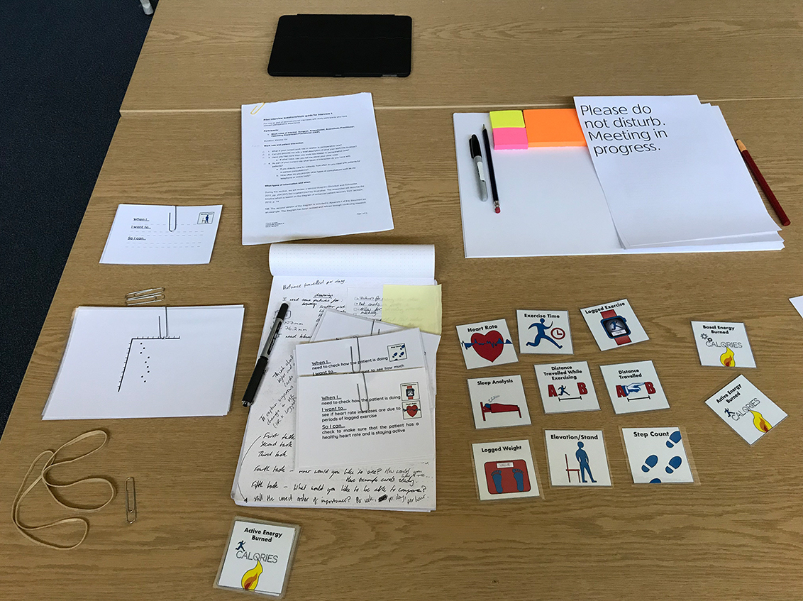

## Introduction
This user research project explored the use of information from patient-owned smartwatches and smartphones to support patient care prior to surgery. It also assessed the informational needs of healthcare professionals, asking what data sources they would need from smartwatches and smartphones. Through the project research, I identified improvements which were later added to Apple WatchOS and Apple Health for iPhone. These included separating walking and running data, automatically detecting workouts, and providing relational data such as walking distance per day.

## Background
While completing an MSc in 2018 I used my dissertation project as an opportunity to explore a real-world area of user research; wearable devices in digital health. The project focused on healthcare professionals as a user group initially to ascertain if the information from these devices was fit for purpose prior to creation of apps and software. The research was ethically approved and took place in a clinical location.

, This is Service Design Doing, pp. 58-63. Created using Adobe Illustrator CC as part of a competitor analysis.    Dotted lines indicate two-way data exchange and read/write relationship.  P ~ Patient, and HCP ~ Healthcare Professional.")

## Objective
To use the problem statement as the basis for an in-depth speculative user experience study to be written up as a dissertation and disseminated back to the UX and healthcare communities.

### Problem Statement
*Could information from patient-owned smartwatches and smartphones be used to support perioperative[^1] care?* 

[^1]: *Perioperative* ~ Encompasses the period prior to surgery, during surgery and through to the conclusion of recovery at home; as defined by the Royal College of Anaesthetists (RCoA, 2014, pp. 4-5).

## Roles, Methods, and Tools
I was main researcher on this project. My work was overseen by two supervisors: one supervisor was from a UX/academic background (named principal investigator), and one from a medical practice background, whom I actively sought out to support the project.

### Highlighted methods
<ul class="skills-list">
<li>Interviews</li>
<li>Survey</li>
<li>Quantitative analysis</li>
<li>Requirements</li>
<li>Personae</li>
</ul>

#### Interviews
In preparation for field work, I engaged in interviews with professional contacts whom had relevant healthcare experience. I co-created a Service Blueprint diagram outlining the patient journey. I also created a glossary, based on the qualitative data from interviews, to ensure that descriptive terms used in the recruitment materials, oral presentations and dissertation were contextually accurate and appropriate.

Alongside this I formed a research collaboration with a healthcare professional working in a relevant role in practice. My collaborator helped to facilitate contextual interviews with healthcare professionals working in a clinical setting. These interviews were used as the basis for discovering data/information requirements. Second interviews were completed with the same participants. A lightweight card sorting exercise was used in the first interview to determine which types of health information were pertinent and in order of importance.

#### Survey of smartwatch owners
I designed a survey, to gauge the attitudes of current smartwatch owners in relation to use of devices for health related purposes. The survey was distributed via online user communities, social media, and via targeted emails. The quantitative findings were presented in the dissertation and used to inform the list and prioritisation of requirements. The open-text responses were used as part of human-factors, looking at the likelihood of technology adoption and potential risks.

[Survey output and opportunity landscape - include software that was used] 

#### Personae and low fidelity prototypes
During the second interviews user personas with the scenarios of a hip replacement and a cesarian section were used to consider the viability of the data and information from smartwatches. Low fidelity prototypes of mocked-up data outputs based on the actual data available from a smartwatch, were used with participants to consider *how* the data could be shown.

[Example personae - include software that was used]

### Outcomes

The results pointed to several key areas of opportunity, these were later validated by features and sensors added to the Apple Watch and WatchOS. The project received a mark of distinction.

### Answer to Problem Statement
**Question**: *Could information from patient-owned smartwatches and smartphones be used to support perioperative care?*

**Answer**: Yes, with patient informed consent and an appropriate means to deliver information securely to healthcare professionals a patient’s smartwatch and smartphone could be used for this purpose.

[Visual summary of the final recommendations Include edited version of the stack slide]

## Feedback

The clinical practice location where healthcare professionals had been involved in the research invited me back to present my findings. Visual design artefacts including the service design blueprint were included in a juried exhibition at the University of Brighton in 2019 (*Show and Tell - The Image in Research*). I presented as part of a UX Brighton evening event (12/02/19).

>"...a careful combination of two different charts - a service blueprint mapping a patient's journey before, through and after surgery, matched with a mental model, which is designed to gain insight from interview transcripts...Complex information...are brought into useful arrangements for further thinking to take place. They derive from research; but they also allow research to move on from them."

Francis Hodgson, curator 
Excerpt from *Show and Tell - The Image in Research*, exhibition catalogue (2019, p.29).

[Include final exhibition image here with the val closeup]

## Reflection
An integral aspect of the project’s success was adopting recognised methods as a framework from the research. I used British Standards Institution’s (BSI) *BS EN ISO 9241-210:2010: Ergonomics of human- system interaction. human-centred design for interactive systems*. The field of user experience design research was not well understood in a clinical context so this helped to validate the methods being used, providing an overview.

Had I continued this research I would have liked to validate the Service Blueprint and mental model with a greater number of healthcare professionals working in perioperative care, specifically physiotherapists.

One of the key outstanding issues, as of writing this case study in 2021, is that Apple WatchOS does not allow the user to set rest days/dates. This  means that any health-focused app could be undermined by that aspect of the WatchOS. There are however many potential benefits for a seasoned smartwatch user who could ignore or adjust activity reminders alongside a customised app for a surgical journey.